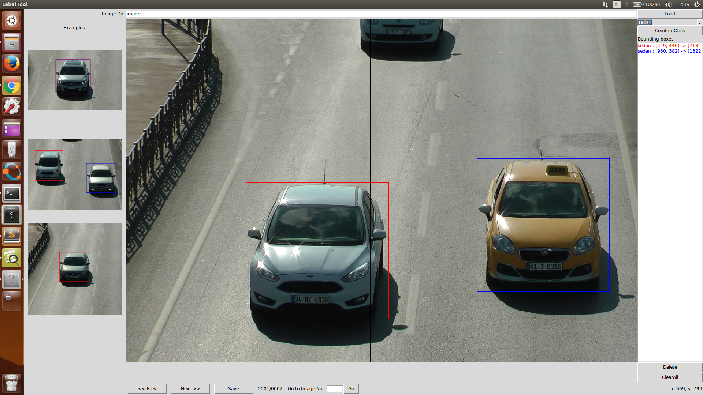

### Forked from [puzzledqs/BBox-Label-Tool](https://github.com/puzzledqs/BBox-Label-Tool)
## Improvements
1. Add multi-class support 
2. Change some of the color-candidates for better display
3. Fix the 'Example' filepath for convenience
4. Change the image format from '.JPEG' to '.jpg'

## New Usage
### For multi-class task, modify 'class.txt' with your own class-candidates and before labeling bbox, choose the 'Current Class' in the Combobox and make sure you click 'ComfirmClass' button.

### The remaining usage is the same as the origin one.

------------------------------------

**Contact info**: jxgu1016@gmail.com

------------------------------------

BBox-Label-Tool
===============

A simple tool for labeling object bounding boxes in images, implemented with Python Tkinter.

**Screenshot:**

Data Organization
-----------------
LabelTool  
|  
|--main.py   *# source code for the tool*  
|  
|--Images/   *# direcotry containing the images to be labeled*  
|  
|--Labels/   *# direcotry for the labeling results*  
|  
|--Examples/  *# direcotry for the example bboxes*  

Environment
----------
- python 2.7
- python PIL (Pillow)

Run
-------
$ python main.py

Usage
-----
0. The current tool requires that **the images to be labeled reside in /Images/imagesFolder1, /Images/imagesFolder2, etc. You will need to modify the code if you want to label images elsewhere**.
1. Input a number (e.g, 1, 2, 5...), and click 'Load'. The images along with a few example results will be loaded.
2. To create a new bounding box, left-click to select the first vertex. Moving the mouse to draw a rectangle, and left-click again to select the second vertex.
  - To cancel the bounding box while drawing, just press <Esc>.
  - To delete a existing bounding box, select it from the listbox, and click 'Delete'.
  - To delete all existing bounding boxes in the image, simply click 'ClearAll'.
3. After finishing one image, click 'Next' to advance. Likewise, click 'Prev' to reverse. Or, input the index and click 'Go' to navigate to an arbitrary image.
  - The labeling result will be saved if and only if the 'Next' button is clicked.
4. To save your labeled image click Save button.

Split video to images
-------
ffmpeg -i videofile -r 10 -f image2 images/image-%07d.png

Convert Images from png to jpeg
-------
mogrify -path outputDir -format jpg -flatten -quality 100 -define jpeg:extent=600kb imagesDir/*.png